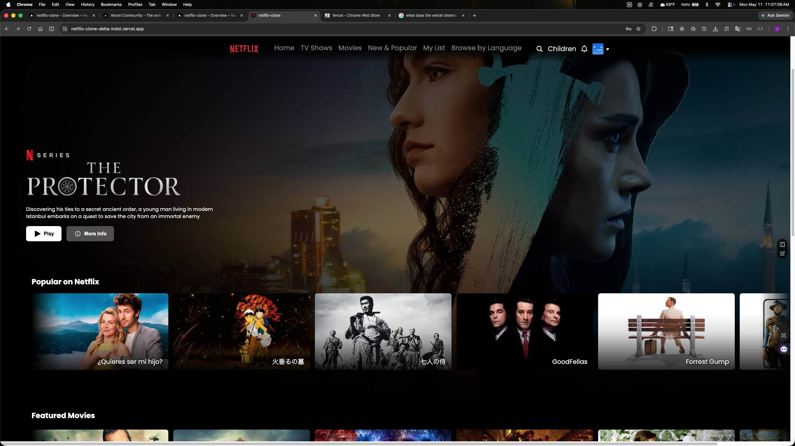
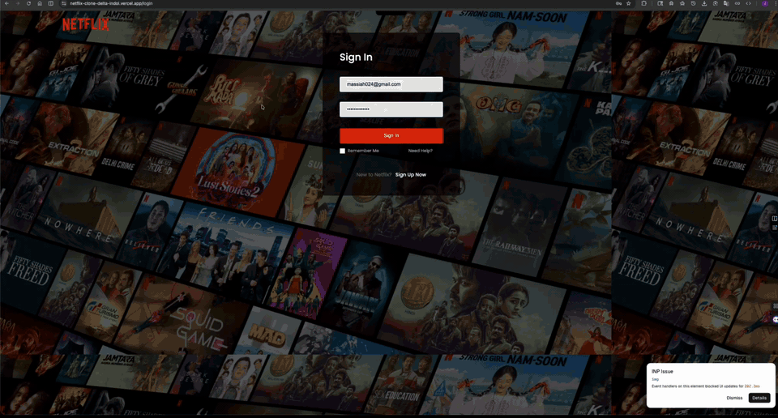
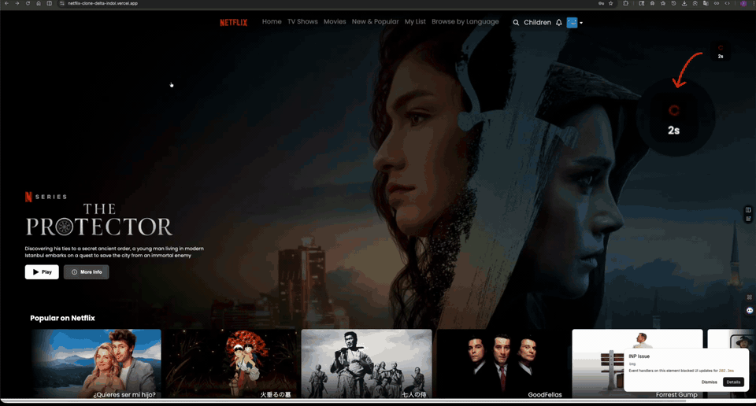
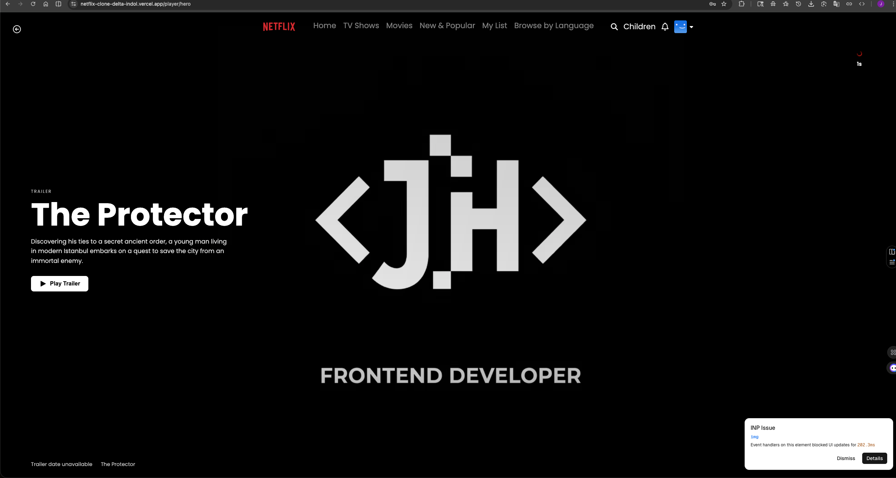
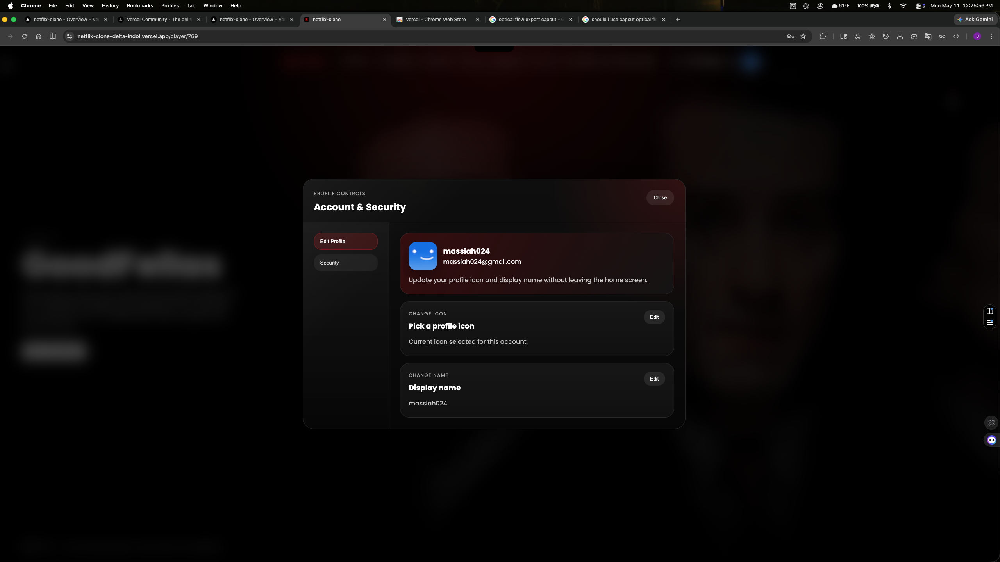

# Netflix Clone

This project is a clone-style streaming UI build with real frontend behavior behind it. I built it to work inside a product language people already know, then pushed on the parts that usually get left flat: auth gating, cinematic autoplay timing, interactive title rails, responsive tuning, and player-state transitions that feel controlled instead of stitched together.

The point was not to invent a new streaming brand just for the sake of originality. It was to recreate a recognizable product experience under tighter visual and structural constraints, preserve the familiar feel, and still make the implementation deeper, cleaner, and more intentional than the expected class-project version of a clone.

## Live Demo

[https://netflix-clone-delta-indol.vercel.app](https://netflix-clone-delta-indol.vercel.app)

## Demo Account

- Email: `massiah024@gmail.com`
- Password: `Random123!321`

## Project Preview

The preview and walkthroughs below show the login flow, hero pacing, player transitions, and profile controls that make this clone feel more like a real streaming product than a static UI copy.



## Walkthrough GIFs

### Login Flow

The sign-in flow uses a real Firebase auth path instead of a decorative mock screen, so the app opens with the same protected-route logic that controls the rest of the experience.



### Autoplay Countdown

This walkthrough shows the homepage trailer waiting on an idle timer before it takes over. The countdown badge is there on purpose, with a zoomed focus treatment that makes the pending autoplay readable right away and gives the trailer handoff real buildup.



## Feature Screens

The screenshots below focus on the player presentation and account settings work that support the broader streaming flow without breaking the established product language.

### Player Preview

This player state keeps the route feeling curated even before full playback takes over. The preview layout, fallback content handling, and branded visual treatment give the player route a real intermediate state before full playback begins.



### Account And Security Modal

The profile dropdown now opens into an account settings modal with profile icon, display name, email, and password controls. It stays inside the same dark cinematic surface language instead of feeling like a generic settings screen dropped in from somewhere else.



## Core Features

- Firebase email/password auth with sign up, sign in, sign out, and route protection
- Public and protected route handling that redirects users based on auth state
- Cinematic homepage hero that fades into trailer playback after 10 seconds of no user activity
- Dedicated player pages with preview mode, manual playback mode, and movie-specific content
- TMDB-driven content rails with dynamic movie backdrops, trailers, and metadata
- Horizontally scrollable title rows with trackpad or mouse-wheel support, arrow controls, and hover-aware reveal behavior
- Responsive navbar, hero, countdown, card-row, and player layouts across desktop, tablet, and mobile
- Motion and visual polish built directly with React state, timers, CSS transitions, overlays, gradients, masks, blur, and layered fade states instead of animation libraries

## Architecture Snapshot

Frontend:

- React 19
- Vite
- React Router 7
- Component-scoped CSS

Auth and Data:

- Firebase Authentication
- Firestore
- TMDB API

Interaction Layer:

- `src/hooks/useAutoplayCountdown.js` handles the countdown timing shared by the hero and player views
- `src/components/TitleCards/TitleCards.jsx` drives the TMDB content rails, wheel-scroll behavior, and route transitions into player pages
- `src/pages/Home/Home.jsx` coordinates hero visibility, autoplay timing, trailer reveal, and content return states
- `src/pages/Player/Player.jsx` handles preview playback, manual playback, fallback data, and movie-specific TMDB fetches

## What I Built

### 1. Real Auth Flow and Route Gating

I built the app around actual account behavior, not just a styled login screen.

That includes:

- Firebase sign up and sign in
- Firestore user document creation during registration
- protected home and player routes
- redirecting signed-out users to `/login`
- redirecting signed-in users away from the auth page
- a loading gate so auth resolution does not flash the wrong screen first

That auth layer matters here because a streaming product stops feeling believable fast if every screen is public and nothing reacts to account state.

### 2. Cinematic Hero Behavior

The homepage hero is where I spent some of the most time because this kind of interface lives or dies on pacing.

The hero uses:

- a 10-second no-activity timer before autoplay begins
- a custom countdown badge with the Netflix spinner
- an `IntersectionObserver` so autoplay stops when the hero is no longer meaningfully in view
- a trailer reveal that fades in only after the countdown completes
- coordinated fade-out of the hero content as the trailer takes over
- content restoration when scroll or mouse activity returns
- masked imagery, overlays, and gradients to keep the transition feeling softer and more cinematic
- hero image masking that lets the banner dissolve more naturally into the background instead of ending in a hard edge

I wanted this area to feel precise. The timer gives autoplay a clear trigger, and the fade timing keeps the handoff from static hero to moving trailer smooth.

### 3. Interactive Title Rails

The content rows are pulling live movie data from TMDB, but the work was not just fetching posters and mapping them out.

I built the rails to support:

- horizontal scrolling with trackpad or mouse-wheel input translated from vertical gestures
- left and right arrow controls
- hover-triggered reveal logic that nudges cards back into view when they sit too close to the row edge
- blur-to-focus emphasis that helps the hovered card read as the active item
- fade treatment across the rails so the rows feel less like a hard strip of cards and more like part of the streaming surface
- dynamic routing into title-specific player pages
- separate categories for top rated, now playing, popular, and upcoming content

I wanted components like rows and cards to keep the familiar Netflix feel while still pushing the interaction and polish far enough to stand above the expected class-project version of a clone.

### 4. Player States That Stay Coordinated

The player page has its own pacing and state rules not just embedding a trailer and calling it done.

It supports:

- preview autoplay after an idle countdown
- manual trailer playback with controls and unmuted audio
- fade-out cinema UI states when the trailer takes over
- timed fade-in of the player surface so the route transition lands smoothly
- content return behavior when activity comes back
- fallback trailer and backdrop handling
- seeded route state from the hero and card rails
- TMDB fetches for title details and available videos when a movie route opens

I handled the hero route and the dynamic movie routes differently on purpose so the experience could feel curated without breaking the reusable player flow.

### 5. Responsive Tuning Inside a Fixed Product Language

This was not a project where I wanted to redesign the category. The challenge was preserving a recognizable streaming-product feel while still making the layout behave well across breakpoints.

I spent time on details like:

- hero caption positioning on large and ultra-wide screens
- countdown scaling so it does not overpower smaller layouts
- navbar label shortening at tighter widths
- keeping card rails scrollable and readable on smaller devices
- maintaining the profile/avatar treatment and overall spacing as the viewport compresses
- avoiding the usual mobile breakdown where a streaming clone turns into stacked blocks with no rhythm left

## Tech Stack

- React 19
- Vite
- React Router 7
- Firebase Authentication
- Firestore
- TMDB API
- `react-firebase-hooks`
- `react-toastify`
- CSS

## Project Structure

```text
src/
  components/
    CountdownBadge/
    Footer/
    Navbar/
    TitleCards/
  hooks/
    useAutoplayCountdown.js
  pages/
    Home/
    Login/
    Player/
  firebase.jsx
```

- `src/App.jsx` defines the public/protected route split and auth-loading gate.
- `src/pages/Home/` contains the hero logic, autoplay orchestration, and home rail composition.
- `src/pages/Player/` handles the movie player experience and TMDB-backed trailer/detail loading.
- `src/components/` holds the reusable navbar, footer, countdown, and content-row UI.
- `src/firebase.jsx` contains the Firebase app setup plus auth helpers used by the login flow.

## Running Locally

```bash
npm install
npm run dev
```

Open [http://localhost:5173](http://localhost:5173).

For a production build:

```bash
npm run build
```

## Current Scope

This project is focused on frontend product behavior:

- auth-aware UI flow
- cinematic homepage and player transitions
- TMDB-driven browsing and trailer playback
- responsive streaming-style layout tuning
- custom motion and polish built directly in the app

It is not trying to be:

- a full subscription platform
- a recommendation engine
- a watch-history system
- a backend-complete streaming service

That boundary is intentional. The value here is showing that I can recreate a familiar product experience with restraint, accuracy, and better implementation depth than a surface-level clone.

## Technical Challenges

- Recreating a recognizable streaming UX without leaning on GSAP, Framer Motion, or prefab motion systems, while still keeping the interface cinematic
- Calibrating the hero timing so the 10-second idle countdown, content fade-out, trailer fade-in, and return-on-activity behavior all stay in sync
- Carrying that same pacing into the dedicated player page so route changes, preview playback, manual playback, and interface fade states read as one system
- Making the TMDB-fed rails responsive to real browsing behavior through trackpad or mouse scrolling, hover reveal timing, edge-aware card movement, and focus treatment so they feel like real browsing surfaces
- Preserving a recognizable streaming-product feel while still pushing polish further through hero masking, row fade treatment, and card hover emphasis without breaking the established product language
- Tuning the layout so the familiar streaming feel holds together across desktop, tablet, mobile, and wider screens without the hero, rails, or overlay states breaking down

## Future Improvements

- stronger API failure and empty-state handling around TMDB fetches
- code-splitting for heavier interactive views
- richer account features like saved titles or watch history
- expanded player metadata and controls

## Closing

This project shows a different kind of frontend skill than a fully original concept build. Sometimes the job is not inventing the visual language. Sometimes the job is preserving one people already trust, then making the behavior feel polished, stable, and worth using. This one is the second kind on purpose.
